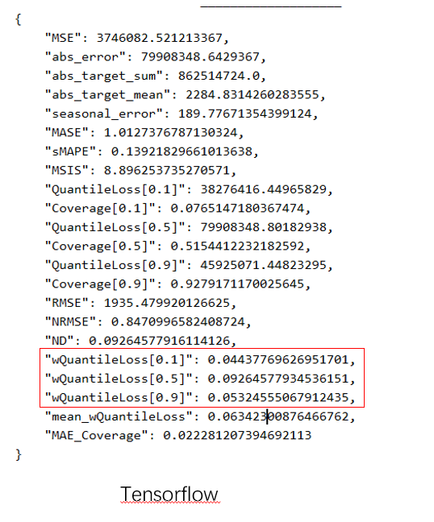
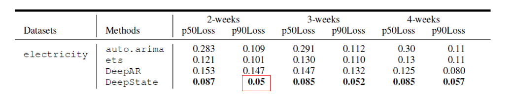
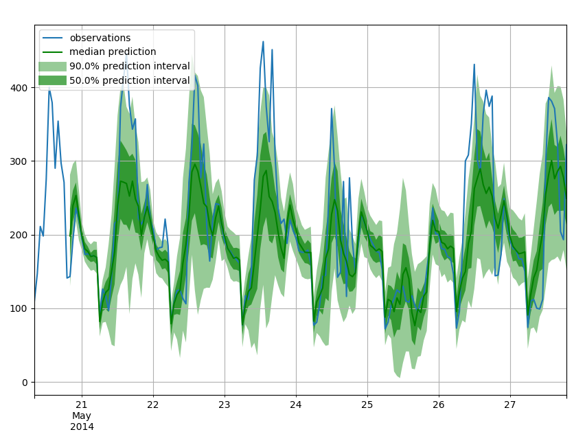
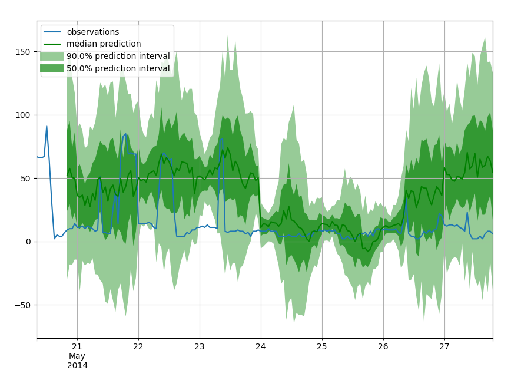

# Deep State Space Model for Time Series

This folder contains a TensorFlow implementation of the algorithms from

 "Deep State Space Model for Time Series Forecasting." NIPS 2018.

[paper address](https://papers.nips.cc/paper/8004-deep-state-space-models-for-time-series-forecasting.pdf)	

This code implements `electricity` dataset of the quantity experiments in the paper

Additionally it contains several Innovation State Space model implementations

`deepdate/models/issm.py`

* Level SSM
* Level Trend SSM
* Seasonality SSM 
* Composite SSM (which compose of SSM Model above )


#### 目录结构

项目的重要结构如下： 

```
gluonts         # 主要的项目文件，请务必包含这个一块使用，因为很多地方使用了这个方法
    lzl_deepstate   #模型主题复现的目录
    ├─run_dssm.py            # 需要运行的程序
    ├─utils
    | ├─config.py     # 配置文件
    | ├─distribution.py  # 一些关于概率分布的方法，主要是高斯
    | └─func.py      # 一些比较奇怪mxnet api，用tf封装
    └─models
      ├─data_loader.py   # 用与产生GroundTruth以及TrainData的generator
      ├─deepstate.py   # 模型的 创建 训练 评估
      ├─evaluation.py   # 一些由AWSLAB提供的衡量标准，已被改成tf
      ├─issm.py   # LGSSM的几种比较简单的形式
      ├─lds.py   # 线性变化模型，包含Kalman Filter的算法
      ├─scaler.py   # 对序列进行缩放，
      └─forecast.py   # 一些由AWSLAB提供的预测方法，在这里直接使用
      
    lzl_test 	#对原代码中的一些代码块做一些测试，同时用于获取数据
        ├─data
        | ├─load_test.py     # 利用原来gluonts的模块，获取测试数据
        | ├─load_train.py  # 利用原来的gluonts模块，获取训练数据
        
```

### 依赖

Requirements before we start:

* TensorFlow 1.14
* gluonts （直接在GitHub上下来下来就可以了），或者直接用本工程文件


#### 数据预处理的代码

因为 Gluonts 已经使用LSTNet帮助我们处理过数据，如果想看数据清洗的代码细节，请查看

`gluonts/dataset/repository/_lstnet.py`

`gluonts/dataset/repository/datasets.py`

当然在代码块中，作者也转换了时间序列，这部分是其数据预处理的精华部分

`gluonts/transformer.py`


#### 加载GluonTS处理好的数据

只需要运行 `lzl_test/load_train.py` 以及 `lzl_test/load_test.py` 即可在`lzl_deepstate/data` 目录下存放数据，命名的格式 为`[train/test]_<dataset_name>_<train_range>_<prediction_range>.csv `

下面说明一下在代码中比较重要的 api

```
dataset_name = "electricity" #指定数据集的名字，距离可以看我上面说的关于数据集的说明
elec_ds = get_dataset(dataset_name, regenerate=False) #包含了数据集的元信息

estimator = DeepStateEstimator(
        freq = elec_ds.metadata.freq,
        prediction_length = elec_ds.metadata.prediction_length*7, #预测长度
        cardinality = [321], #这里一般表示数据集存在多少列
        add_trend = False, # 表明是否要在SSM中添加Trend的信息
        num_periods_to_train = 3, # 表示训练窗口与预测窗口的倍数关系
        trainer = Trainer(epochs=25,batch_size=1,num_batches_per_epoch=100000, hybridize=False), #这里在这里注意 batch_size =1 , 以及num_batches_per_epoch足够大
        num_layers = 3,
        num_cells = 40,
        cell_type = "lstm",
        num_eval_samples = 100,
        dropout_rate = 0.1,
        use_feat_dynamic_real = False,
        use_feat_static_cat = True,
        scaling = True
        )
```

设定好之后，直接运行，便可以获取 GluonTS处理好的数据集


#### Training  Predict  Evaluation

通过运行如下路径中的代码，就可以直接运行

 `gluonts/lzl_deepstate/run_dssm.py`:

```
config = get_image_config()  #获取配置文件
config = reload_config(config.FLAGS)

if ('/lzl_deepstate' not in os.getcwd()):
     os.chdir('gluonts/lzl_deepstate')
     print('change os dir : ',os.getcwd())

configuration = tf.compat.v1.ConfigProto()
configuration.gpu_options.allow_growth = True
with tf.compat.v1.Session(config=configuration) as sess:
    dssm = DeepStateNetwork(config=config,sess=sess)\
        .build_module().build_train_forward().build_predict_forward().initialize_variables()
    dssm.train() #需要在config中设置reload_model 为空
    dssm.predict() #也可以直接不训练，但是要在config中设置reload_model为你训练好的模型
    dssm.evaluate() #进行评估以及 画图
```


#### 本人复现的实验结果如下

数据集： electricity

训练长度: 2-weeks

预测长度: 1-week





预测的效果如下：



